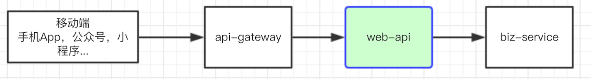

###简介:

面向移动端（手机App，公众号，小程序.....）提供的API服务脚手架开发框架，项目代码：

>[https://github.com/backkoms/web-api-demo](https://github.com/backkoms/web-api-demo)
>
>[https://gitee.com/Kristening/web-api-demo](https://gitee.com/Kristening/web-api-demo)

可用于实施基于Dubbo的分布式/微服务项目开发、重构等等，下载到本地，包名稍做调整即可关注业务进行API开发。

###项目定位：
>面向移动端提供API服务，不处理具体业务逻辑，需调用后端的[Dubbo]服务处理。可用于从大单体应用中解耦，实施前后端分离部署、分层部署。

>可配合web-service-demo使用。
APITestController.java文件中DemoService接口依赖web-service-demo中的web-service-i模块，若暂无需求可将其注释掉。

###技术组件：
- Spring Boot 2.0.4.RELEASE
- Swagger 2.6.1
- Dubbo-spring-boot-starter 0.2.0
- Lombok 1.16

###提供功能：
- Swagger集成，对外提供友好的API界面
- 基于profiles提供的多环境打包构建
- 集成Log4j日志服务，替代原有的logging日志组件
- 集成lombok，简化实体的编写
- 结合AOP，实现简单的安全验证，如接口验签、接口速率限制、黑白名单（结合具体业务场景实现）
- 集成Docker构建插件，可打包成Docker镜像运行

>注：web-service-demo的Github项目地址：
>
>https://github.com/backkoms/web-service-demo
>
https://gitee.com/Kristening/web-service-demo

>基于SpringBoot2和Dubbo的微服务开发框架，已集成Rabbitmq、Redis、Mybatis。

#联系我

微信号：Dqango

#SpringCloud微服务实战实例

[https://github.com/backkoms/simplemall](https://github.com/backkoms/simplemall)

[源码解读](https://xiaozhuanlan.com/msa-practice)
